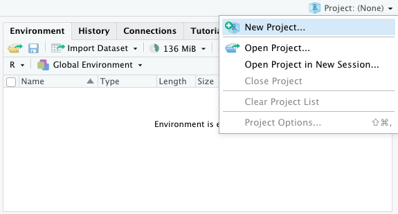
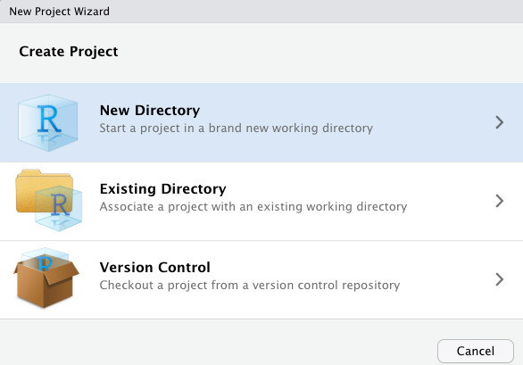
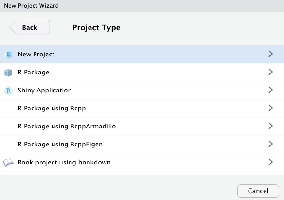
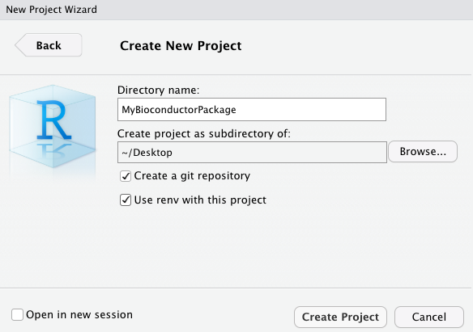
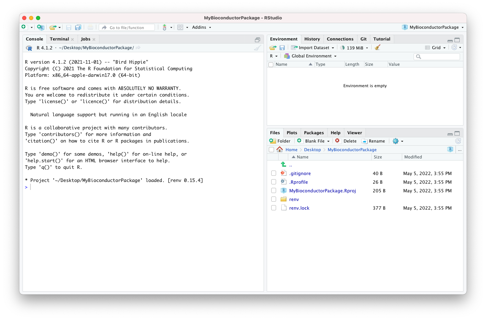

# Making an Bioconductor package {#bioc-package}

This chapter demonstrates the making of a Bioconductor package using the
Bioconductor package `r BiocStyle::Biocpkg("biocthis")`.

This is just one example of an opinionated workflow for making a
Bioconductor-friendly package, highlighting a community effort
with the goal of helping automate the process of creating R packages for
Bioconductor or making them Bioconductor-friendly.

It is not a requirement to follow this workflow when preparing a package for
submission to the Bioconductor repository.
Many package developers learn from their earlier experience and develop
their own personal preferences and templates, when working on their subsequent
packages.

Throughout this chapter, this example is used to illustrate essential and
recommended components for Bioconductor packages, to give readers knowledge
and information allowing them to develop Bioconductor packages indepedently
of this workflow, if they so wish.

## Pre-requisites

This workflow was written on the operating system macOS Big Sur.
Other operating systems may require some adjustments.

This workflow uses [RStudio Desktop](https://www.rstudio.com/products/rstudio/download/).

This workflow was written using R version 4.1.2 (2021-11-01) -- "Bird Hippie".

## New RStudio project











## Deprecated

### usethis

The function `usethis::create_package()` can be used to initialise the skeleton of an R package.

```{r, eval=FALSE}
usethis::create_package("~/Desktop/NewBiocPackage")
```

That command will initialise the skeleton of an R package in the requested directory.
The name of the package will be set to the name of the new directory, in this case `NewBiocPackage`.

```
✓ Creating '/Users/kevin/Desktop/NewBiocPackage/'
✓ Setting active project to '/Users/kevin/Desktop/NewBiocPackage'
✓ Creating 'R/'
✓ Writing 'DESCRIPTION'
Package: NewBiocPackage
Title: What the Package Does (One Line, Title Case)
Version: 0.0.0.9000
Authors@R (parsed):
    * First Last <first.last@example.com> [aut, cre] (YOUR-ORCID-ID)
Description: What the package does (one paragraph).
License: `use_mit_license()`, `use_gpl3_license()` or friends to
    pick a license
Encoding: UTF-8
Roxygen: list(markdown = TRUE)
RoxygenNote: 7.0.0
✓ Writing 'NAMESPACE'
✓ Writing 'NewBiocPackage.Rproj'
✓ Adding '^NewBiocPackage\\.Rproj$' to '.Rbuildignore'
✓ Adding '.Rproj.user' to '.gitignore'
✓ Adding '^\\.Rproj\\.user$' to '.Rbuildignore'
✓ Opening '/Users/kevin/Desktop/NewBiocPackage/' in new RStudio session
✓ Setting active project to '<no active project>'
```

### biocthis

The `r BiocStyle::Biocpkg('biocthis')` package provide convenient utilities to automate package and project setup for Bioconductor packages.

- [`biocthis::use_bioc_pkg_templates()`](https://lcolladotor.github.io/biocthis/reference/use_bioc_pkg_templates.html) creates four `dev/*.R` scripts that guide you in the process of setting up an RStudio project for a Bioconductor-friendly R package. 
- 2021-01-28 [two minute video](https://youtu.be/3fLNsLchPnI) in Spanish for ConectaR 2021. [Slides in Spanish](https://speakerdeck.com/lcolladotor/biocthis-conectar2021).
- 2020-11-05 [slides in English](https://speakerdeck.com/lcolladotor/biocthis-tab) for the Bioconductor Technical Advisory Board. 
- 2020-09-10 [55 minute video in English](https://youtu.be/aMTxkYsM-8o). [ Slides in English](https://speakerdeck.com/lcolladotor/making-bioc-packages-with-biocthis).

## Resources

> Contribute!
> 
> Introduce and discuss the links below.

- [Link to Kayla’s from Bioc2020](TODO)
- [BJ’s Boston Meetup](TODO)
- [Saskia’s video](TODO)
- [Template Bioconductor package (in development)](https://github.com/kevinrue/BiocPackageSofwareTemplate)
- [Bioconductor Package Guidelines for Developers and Reviewers](https://github.com/kevinrue/bioc_package_guide)
- [Building a Bioconductor package using RStudio](https://github.com/SaskiaFreytag/making_bioconductor_pkg)
- [lshep/MakeAPackage](https://github.com/lshep/MakeAPackage)