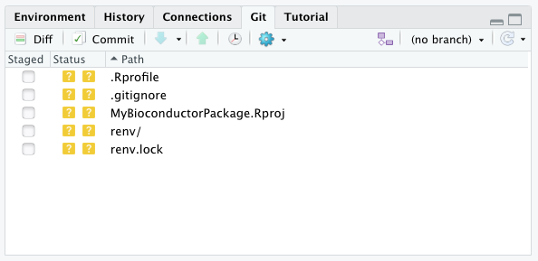
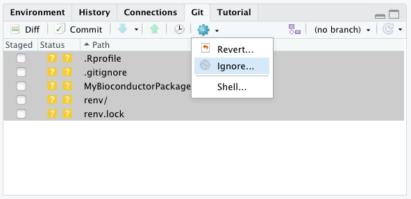
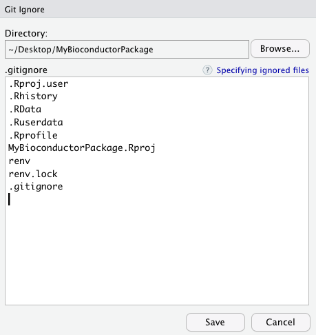
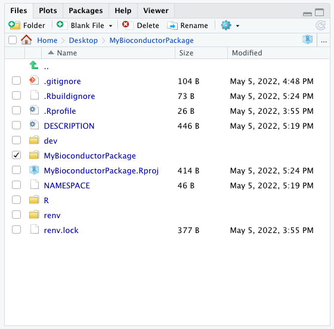
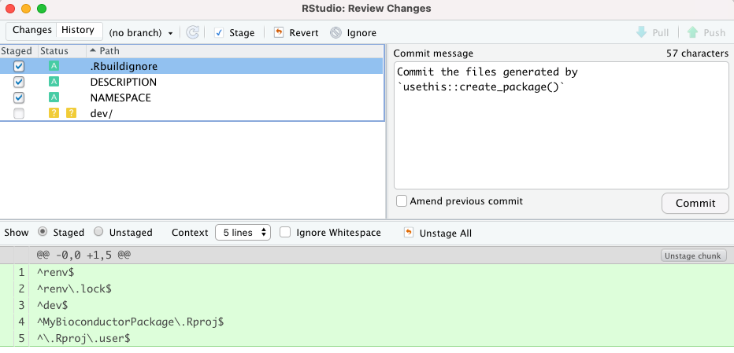

# Making a Bioconductor package {#bioc-package}

This chapter demonstrates the making of a Bioconductor package using the
Bioconductor package `r BiocStyle::Biocpkg("biocthis")`.

This is just one example of an opinionated workflow for making a
Bioconductor-friendly package, highlighting a community effort
with the goal of helping automate the process of creating R packages for
Bioconductor or making them Bioconductor-friendly.

It is not a requirement to follow this workflow when preparing a package for
submission to the Bioconductor repository.
Many package developers learn from their earlier experience and develop
their own personal preferences and templates, when working on their subsequent
packages.

Throughout this chapter, this example is used to illustrate essential and
recommended components for Bioconductor packages, to give readers knowledge
and information allowing them to develop Bioconductor packages indepedently
of this workflow, if they so wish.

## Pre-requisites

This workflow was written on the operating system macOS Big Sur.
Other operating systems may require some adjustments.

This workflow uses [RStudio Desktop](https://www.rstudio.com/products/rstudio/download/).

This workflow was written using R version 4.1.2 (2021-11-01) -- "Bird Hippie".

## New RStudio project

In the top right corner of the RStudio application, click on `New Project...`.

{width=66%}

In the `New Project Wizard`, select the option `New Directory`.

{width=66%}

Then, click on `New Project`.

{width=66%}

Then, type the name of your package in the field `Directory Name`,
this will also be used as the name of a new directory in which your package
will be stored.
Select a parent directory on your computer where that new directory will be
created.

In this example, we allow the RStudio application to initialise a
[git](TODO) repository and a [renv](TODO) environment.

It is recommended to initialise a git repository as early as possible in the
lifecycle of the package, to facilitate version control.

The `r BiocStyle::CRANpkg("renv")` package is a great option to manage
the environment in which the package is developped, independently from any other
RStudio project on your computer.

When you are ready, click the button `Create Project`.

{width=66%}

The RStudio application should display the newly created project as follows.

{width=100%}

Notes:

- In the example above, the file `.gitignore` was created becaused we opted
  to `Create a git repository`.
- Similarly, the files and directories `.Rprofile`, `renv/`, and `renv.lock`
  were created becaused we opted to `Use renv with this project`.

## Exclude initial files from version control

In this example, we opted to let the RStudio application initialise a git
repository for us in the newly created project directory.

Files that have been created, modified, or deleted are listed in the Git panel
of the RStudio application.

{width=66%}

In this example, all the files initially created are only relevant to the
local development of the package, and should be excluded from version control.

Select all the files, click on the wheel, and click on `Ignore...`.

{width=66%}


In the modal window that opens, check that all the files to ignore were added.
The RStudio application may not automatically add the file `.gitignore`,
in which case you can type it manually yourself on a new line.
It is recommended to add an empty line at the end of the file.

When you are ready, click the button `Save`.

{width=66%}

The Git panel of the RStudio application should be empty now.

## Install BiocManager and biocthis

In this example, we use the package `r BiocStyle::CRANpkg("renv")` to create
and manage the environment in which the package is developed, independently
from any other RStudio project on the same computer.

However, a consequence of this is that the newly created environment does not
contain any R package other than the base R packages.

First, install the CRAN package `r BiocStyle::CRANpkg("BiocManager")`.

```{r, eval=FALSE}
install.packages("BiocManager")
```

Then, install the Bioconductor package `r BiocStyle::Biocpkg("biocthis")`.

```{r, eval=FALSE}
BiocManager::install("biocthis")
```

If prompted whether you "want to install from sources the package which needs compilation? (Yes/no/cancel)", type `Yes` and press the Return key.

## Create a package template

Call the function `biocthis::use_bioc_pkg_templates()` from the R console panel
in the RStudio application.

```{r, eval=FALSE}
biocthis::use_bioc_pkg_templates()
```

The function creates a sub-directory `dev/` and a number of R scripts that are
designed to help us create our new Bioconductor-friendly package.
The RStudio application will automatically open the newly created scripts in the
Source panel.

In the next sections, we will go through those scripts.

## Create the R package

Open the script  `dev/01_create_pkg.R` and follow instructions therein.

First, the script install the CRAN package `r BiocStyle::CRANpkg("remotes")`,
if it is not available yet (it is not, as we opted to develop this package
in a new environment using `r BiocStyle::CRANpkg("renv")`).

```{r, eval=FALSE}
if (!requireNamespace("remotes", quietly = TRUE)) {
    install.packages("remotes")
}
```

Next, the script immediately used the newly installed package to install a
number of CRAN packages that will be used to develop the new Bioconductor
package.

```{r, eval=FALSE}
remotes::install_cran(
    c(
        "available",
        "BiocManager",
        "biocthis",
        "devtools",
        "knitr",
        "pkgdown",
        "RefManageR",
        "rmarkdown",
        "rstudioapi",
        "sessioninfo",
        "styler",
        "usethis"
    )
)
```

Next, the script installs the Bioconductor package
`r BiocStyle::Biocpkg("BiocStyle")`, if it is not installed yet.
That package will be used for styling the vignettes of the new Bioconductor
package and linking to other packages.

```{r, eval=FALSE}
if (!requireNamespace("BiocStyle", quietly = TRUE)) {
    BiocManager::install("BiocStyle")
}
```

Next, the script offers you some code to check whether the name of your package
is already in use, or has a meaning that you might not be aware of.

Note that the function `available::available()` will display some information in
the R console of the RStudio application, indicating whether the package name
is valid and available on CRAN, Bioconductor, and GitHub.
The function will also open a number of tabs in your default web browser,
on Wikipedia, Wiktionary, and other websites,
displaying the result of searches for your package name on those websites.
It is up to you to check the contents of those pages and decide whether you
wish to continue the process with that package name.

```{r, eval=FALSE}
available::available("MyBioconductorPackage")
```

When we are satisfied with the name of your package, the next step in the script
creates a package template 

```{r, eval=FALSE}
usethis::create_package("MyBioconductorPackage")
```

If prompted whether you want to create a new project nested inside an existing
project, type the number associated with the positive answer and press the
Return key.

If prompted whether you want to overwrite the pre-existing `*.Rproj` file, 
type the number associated with the positive answer and press the Return key.

At this point, the RStudio application will reload and a number of newly created
files and directories will be visible in the Files panel.

In this example, an empty sub-directory with the name of the name of the package
was created.
This sub-directory is a supefluous artifact of the process, which should be
removed.
Click on the checkbox next to the sub-directory, click the `Delete` button,
and click the `Yes` button in the modal to confirm.



## First commit

The Git panel of the RStudio application should now list a number of files
created by the CRAN package `r BiocStyle::CRANpkg("usethis")` in the previous
step.
Those files - `.Rbuildignore`, `DESCRIPTION`, and `NAMESPACE` - are the first
files of the new Bioconductor package.
They must be commited to the git repository.

Tick the checkbox next to the files - ignore the directory `dev/` created
earlier by the Bioconductor package `BiocStyle::Biocpkg("biocthis")` - and click
the button `Diff`.


Add a commit message and click the button `Commit`.



## Deprecated

### usethis

The function `usethis::create_package()` can be used to initialise the skeleton of an R package.

```{r, eval=FALSE}
usethis::create_package("~/Desktop/NewBiocPackage")
```

That command will initialise the skeleton of an R package in the requested directory.
The name of the package will be set to the name of the new directory, in this case `NewBiocPackage`.

```
✓ Creating '/Users/kevin/Desktop/NewBiocPackage/'
✓ Setting active project to '/Users/kevin/Desktop/NewBiocPackage'
✓ Creating 'R/'
✓ Writing 'DESCRIPTION'
Package: NewBiocPackage
Title: What the Package Does (One Line, Title Case)
Version: 0.0.0.9000
Authors@R (parsed):
    * First Last <first.last@example.com> [aut, cre] (YOUR-ORCID-ID)
Description: What the package does (one paragraph).
License: `use_mit_license()`, `use_gpl3_license()` or friends to
    pick a license
Encoding: UTF-8
Roxygen: list(markdown = TRUE)
RoxygenNote: 7.0.0
✓ Writing 'NAMESPACE'
✓ Writing 'NewBiocPackage.Rproj'
✓ Adding '^NewBiocPackage\\.Rproj$' to '.Rbuildignore'
✓ Adding '.Rproj.user' to '.gitignore'
✓ Adding '^\\.Rproj\\.user$' to '.Rbuildignore'
✓ Opening '/Users/kevin/Desktop/NewBiocPackage/' in new RStudio session
✓ Setting active project to '<no active project>'
```

### biocthis

The `r BiocStyle::Biocpkg('biocthis')` package provide convenient utilities to automate package and project setup for Bioconductor packages.

- [`biocthis::use_bioc_pkg_templates()`](https://lcolladotor.github.io/biocthis/reference/use_bioc_pkg_templates.html) creates four `dev/*.R` scripts that guide you in the process of setting up an RStudio project for a Bioconductor-friendly R package. 
- 2021-01-28 [two minute video](https://youtu.be/3fLNsLchPnI) in Spanish for ConectaR 2021. [Slides in Spanish](https://speakerdeck.com/lcolladotor/biocthis-conectar2021).
- 2020-11-05 [slides in English](https://speakerdeck.com/lcolladotor/biocthis-tab) for the Bioconductor Technical Advisory Board. 
- 2020-09-10 [55 minute video in English](https://youtu.be/aMTxkYsM-8o). [ Slides in English](https://speakerdeck.com/lcolladotor/making-bioc-packages-with-biocthis).

## Resources

> Contribute!
> 
> Introduce and discuss the links below.

- [Link to Kayla’s from Bioc2020](TODO)
- [BJ’s Boston Meetup](TODO)
- [Saskia’s video](TODO)
- [Template Bioconductor package (in development)](https://github.com/kevinrue/BiocPackageSofwareTemplate)
- [Bioconductor Package Guidelines for Developers and Reviewers](https://github.com/kevinrue/bioc_package_guide)
- [Building a Bioconductor package using RStudio](https://github.com/SaskiaFreytag/making_bioconductor_pkg)
- [lshep/MakeAPackage](https://github.com/lshep/MakeAPackage)